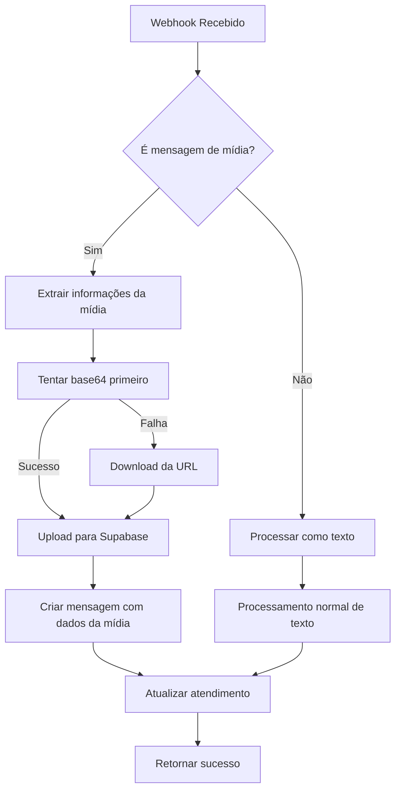

# Integração de Mídias no Webhook WhatsApp

## Overview

O sistema foi atualizado para processar e armazenar mídias (imagens, vídeos, áudios e documentos) recebidas através do webhook do WhatsApp.

## Funcionalidades Implementadas

### ✅ Tipos de Mídia Suportados
- **Imagens**: JPEG, PNG, GIF, WebP
- **Vídeos**: MP4, 3GP, MOV
- **Áudios**: MP3, OGG, WAV
- **Documentos**: PDF, TXT, DOC, etc.

### ✅ Armazenamento
- Bucket `midias` no Supabase Storage
- Organização por empresa: `empresas/{empresaId}/`
- Nome de arquivo único: `{tipo}_{messageId}_{timestamp}.{extensão}`

### ✅ Processamento
- Detecção automática de tipo de mídia
- Download via URL da Evolution API
- Upload para Supabase Storage
- Fallback para base64 (quando disponível)
- Captura de captions/legendas

## Estrutura dos Dados

### Mensagem com Mídia (Exemplo)

```json
{
  "event": "messages.upsert",
  "instance": "IALISSON",
  "data": {
    "key": {
      "remoteJid": "558189951170@s.whatsapp.net",
      "fromMe": false,
      "id": "3EB0194B12B8A7F8FD4EAB"
    },
    "pushName": "Juan",
    "messageType": "imageMessage",
    "message": {
      "imageMessage": {
        "url": "https://mmg.whatsapp.net/...",
        "mimetype": "image/jpeg",
        "caption": "Legenda da imagem",
        "base64": "base64_encoded_image_data"
      }
    }
  }
}
```

### Campos Adicionados na Tabela `mensagens`

- `media_url`: URL pública da mídia no Supabase Storage
- `media_type`: MIME type da mídia
- `media_name`: Nome original do arquivo
- `message_type`: Tipo da mensagem (text, image, video, audio, document)

## Fluxo de Processamento



## Uso

### Endpoint Principal
```
POST /api/webhook/whatsapp
```

### Endpoint de Teste
```
POST /api/test/media
Content-Type: application/json

{
  "type": "image"  // "audio", "image", "video"
}
```

## Configuração

### Variáveis de Ambiente
```env
SUPABASE_URL=your_supabase_url
SUPABASE_SERVICE_ROLE_KEY=your_service_role_key
```

### Permissões do Storage
O bucket `midias` foi criado com as seguintes configurações:
- **Privado**: Acesso controlado por políticas RLS
- **Tamanho máximo**: 50MB por arquivo
- **MIME types permitidos**: Imagens, vídeos, áudios e documentos comuns

## Logging

O sistema inclui logs detalhados para monitoramento:
- `📷 Mensagem de mídia detectada`
- `🔽 Baixando mídia da Evolution API`
- `📤 Fazendo upload para Supabase Storage`
- `✅ Upload realizado com sucesso`

## Tratamento de Erros

- **Download falhou**: Tenta usar base64 se disponível
- **Upload falhou**: Continua com processamento de texto apenas
- **Base64 inválido**: Tenta download da URL
- **Storage indisponível**: Log de erro e continuidade do fluxo

## Performance

- Prioriza uso de base64 (mais rápido)
- Upload em streaming para arquivos grandes
- Cache control de 1 hora para URLs públicas
- Processamento assíncrono para não bloquear webhook

## Exemplos de Uso

### Processar Imagem com Caption
```javascript
// O sistema automaticamente:
// 1. Detecta que é imageMessage
// 2. Extrai caption como texto da mensagem
// 3. Baixa a imagem ou usa base64
// 4. Faz upload para o bucket midias
// 5. Salva URL e metadados na mensagem
```

### Processar Áudio
```javascript
// Para mensagens de áudio:
// 1. Detecta audioMessage
// 2. Gera texto descritivo "🎵 Áudio"
// 3. Processa arquivo de áudio
// 4. Armazena com extensão .ogg/.mp3/.wav
```

## Monitoramento

### Logs Importantes
- `media.processed`: Mídia processada com sucesso
- `media.processing_failed`: Falha no processamento
- `webhook.media_processed`: Webhook de mídia concluído

### Métricas
- Tempo de processamento por tipo de mídia
- Taxa de sucesso de uploads
- Espaço utilizado no storage
- Volume de mídias por empresa

## Futuras Melhorias

- [ ] Compressão automática de imagens
- [ ] Transcodificação de vídeos
- [ ] Cache local de mídias frequentes
- [ ] Detecção de conteúdo inapropriado
- [ ] Geração de thumbnails para vídeos
- [ ] Suporte a stickers do WhatsApp